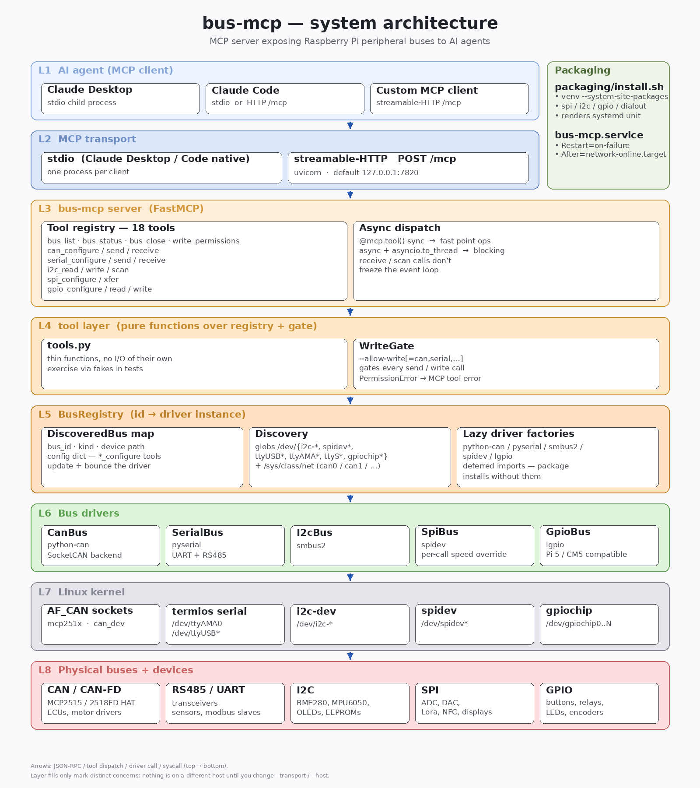

# bus-mcp

An MCP server that gives an AI agent (Claude Desktop, Claude Code, or any
MCP-compatible client) direct access to a Raspberry Pi's peripheral buses:

- **CAN / CAN-FD** — SocketCAN (PiCAN, Waveshare 2-CH CAN HAT, on-board CAN on CM5)
- **RS485 / UART** — pyserial (`/dev/ttyUSB*`, `/dev/ttyAMA*`, `/dev/ttyS*`)
- **I2C** — smbus2 (`/dev/i2c-1`, `/dev/i2c-3`)
- **SPI** — spidev (`/dev/spidev0.0`, etc.)
- **GPIO** — lgpio (Pi 4 / Pi 5 / CM4 / CM5)

The agent gets a small, opinionated tool set — `bus_list`, `can_send`,
`i2c_read`, `gpio_write`, … — plus per-bus `*_configure` tools so it can
retune bitrate / baud / SPI mode mid-session. Point Claude at a Pi and
it can talk to a sensor, dump CAN traffic, or wiggle a pin without you
writing a Python script first.



## Quick install on a Pi

```bash
git clone https://github.com/Pan-Robotics/bus-mcp.git
cd bus-mcp
./packaging/install.sh --allow-write
```

That's it. The installer:

- creates `~/.local/share/bus-mcp/.venv` with `--system-site-packages`
  so apt-packaged `lgpio` / `pyserial` / `smbus2` / `spidev` are reused
  (no SWIG rebuild)
- installs `mcp` + `python-can` + `bus-mcp` itself
- adds you to `spi` / `i2c` / `gpio` / `dialout` groups
- installs `/etc/systemd/system/bus-mcp.service` and enables it
- prints the MCP endpoint URL + the `claude mcp add` line for your host

It does **not** touch `/boot/firmware/config.txt` (CAN HAT overlays vary
by HAT variant), pick a CAN bitrate, or open firewall ports.

Re-running is idempotent. To remove everything: `./packaging/install.sh --uninstall`.

## Manual install (PyPI, no systemd)

On a Pi:

```bash
pip install "bus-mcp[pi-all]"
```

On a dev laptop (no hardware) — for editing + tests:

```bash
pip install bus-mcp
```

The bus libraries (`python-can`, `pyserial`, `smbus2`, `spidev`, `lgpio`)
load lazily. Missing libs only error when you call a tool that needs them.

## Run

```bash
bus-mcp list                            # show discovered buses
bus-mcp serve                           # stdio (Claude Desktop / Code)
bus-mcp serve --allow-write             # writes on every bus
bus-mcp serve --allow-write=can,serial  # writes only on CAN + serial

# HTTP / streamable-http transport (localhost only by default)
bus-mcp serve --transport http
bus-mcp serve --transport http --port 7820 --allow-write
bus-mcp serve --transport http --host 0.0.0.0 --port 7820  # LAN-reachable
```

The HTTP endpoint is at `http://<host>:<port>/mcp` and speaks the MCP
streamable-HTTP protocol (POST JSON-RPC, response as a single SSE
message). The default bind is `127.0.0.1` so the server is invisible
outside the Pi until you opt in with `--host 0.0.0.0` (and an SSH
tunnel / firewall rule to fence access).

## Wire into Claude Desktop (stdio)

Edit `~/.config/Claude/claude_desktop_config.json`:

```json
{
  "mcpServers": {
    "bus-mcp": {
      "command": "bus-mcp",
      "args": ["serve", "--allow-write"]
    }
  }
}
```

## Wire into Claude Code

stdio (Claude Code on the same Pi):

```bash
claude mcp add bus-mcp -- bus-mcp serve --allow-write
```

HTTP (Pi reachable on `pi.local:7820`, or substitute your hostname / IP):

```bash
claude mcp add --transport http bus-mcp http://pi.local:7820/mcp
```

The installer prints the exact URL for your host at the end of its run.

## Tools the agent gets

| Tool                | Purpose                                                |
| ------------------- | ------------------------------------------------------ |
| `bus_list`          | Enumerate discovered buses                             |
| `bus_status`        | Inspect descriptor + stored config (no driver open)    |
| `bus_close`         | Release a bus the agent opened earlier                 |
| `write_permissions` | Show which bus kinds writes are enabled on             |
| `can_configure`     | Set bitrate / fd / data_bitrate / restart_ms           |
| `can_send`          | Transmit a CAN / CAN-FD frame                          |
| `can_receive`       | Drain frames with an optional kernel filter            |
| `serial_configure`  | Set baudrate / bytesize / parity / stopbits / flow     |
| `serial_send`       | Write bytes to a UART / RS485 port                     |
| `serial_receive`    | Read bytes from a UART / RS485 port                    |
| `i2c_read`          | Read from a device register                            |
| `i2c_write`         | Write to a device register                             |
| `i2c_scan`          | `i2cdetect`-equivalent address probe                   |
| `spi_configure`     | Set max_speed_hz / mode / bits_per_word / lsb_first    |
| `spi_xfer`          | Full-duplex transfer (optional per-call speed)         |
| `gpio_configure`    | Set direction / pull / active-low / debounce           |
| `gpio_read`         | Read a pin                                             |
| `gpio_write`        | Drive a pin                                            |

`*_configure` tools take all fields as optional kwargs — pass only what
you want to change. The bus is closed immediately so the next call
reopens it with the new config. Blocking receive tools (`can_receive`,
`serial_receive`, `i2c_scan`) run on a worker thread via
`asyncio.to_thread`, so a single client can hold a long receive open
while firing other tool calls in parallel.

## Safety

Default is **read-only on every bus**. Write tools refuse cleanly with a
message that names the right `--allow-write` flag. Refusals are returned
as MCP tool errors so the agent can surface the state instead of
crashing.

There is no protocol-level checking past the write gate: if you enable
writes and the agent transmits a destructive CAN frame, your ECU sees
it. Use this on bench setups, not on a live vehicle without a hardware
kill switch.

## Verifying on a Pi — Waveshare 2-CH CAN HAT loopback

The [Waveshare 2-CH CAN HAT][wsh] gives you two MCP2515 channels exposed
as `can0` + `can1`. With both channels wired into each other
(CAN_H ↔ CAN_H, CAN_L ↔ CAN_L, **plus the on-board 120 Ω termination
jumpers enabled on both sides**), frames sent on one channel land on
the other — a perfect end-to-end test.

[wsh]: https://www.waveshare.com/2-ch-can-hat.htm

```bash
# 1. Enable SPI + the overlays (one-time).
#    These values are for the ORIGINAL 2-CH CAN HAT (16 MHz crystals,
#    IRQs on GPIO 23 + 25). The HAT+ variant uses different pins —
#    check your HAT before pasting.
sudo raspi-config nonint do_spi 0
sudo tee -a /boot/firmware/config.txt <<'EOF'
dtoverlay=mcp2515-can0,oscillator=16000000,interrupt=23
dtoverlay=mcp2515-can1,oscillator=16000000,interrupt=25
EOF
sudo reboot

# 2. After reboot — bring both interfaces up.
sudo ip link set can0 up type can bitrate 500000
sudo ip link set can1 up type can bitrate 500000

# 3. Install bus-mcp and start it.
./packaging/install.sh --allow-write    # or: bus-mcp serve --transport http --allow-write &

# 4. From an agent (or curl directly), exercise the loopback:
#    - on can0: can_send {arbitration_id=0x123, data_hex="deadbeef"}
#    - on can1: can_receive {timeout_s=1, count=1}
#    expect: one frame with arbitration_id=0x123, data="deadbeef"
```

A raw curl smoke-test (initialize the MCP session) — substitute your Pi's
hostname / IP for `<HOST>`:

```bash
curl -i -X POST -H 'Content-Type: application/json' \
  -H 'Accept: application/json, text/event-stream' \
  --data '{"jsonrpc":"2.0","id":1,"method":"initialize","params":{"protocolVersion":"2024-11-05","capabilities":{},"clientInfo":{"name":"test","version":"0.0.1"}}}' \
  http://<HOST>:7820/mcp
```

If the controllers settle into `ERROR-PASSIVE` instead of `ERROR-ACTIVE`
(`ip -details link show can0`), the on-board termination jumpers
probably aren't enabled. Either turn them on or drop the bitrate to
something the bus can sustain (`sudo ip link set can0 down; sudo ip
link set can0 type can bitrate 250000; sudo ip link set can0 up`).

## Architecture

See [`docs/architecture.png`](docs/architecture.png) for the full
layered view, or re-render after editing:

```bash
python docs/render_arch.py    # writes docs/architecture.png
```

The render script (`docs/render_arch.py`) uses pure-PIL — no `dot` /
`mmdc` / browser engines — and auto-sizes each layer band from its
tallest box, so adding tools or drivers doesn't require manual layout
tuning.

## Logs + service control (systemd install only)

```bash
sudo systemctl status bus-mcp           # is it up?
sudo systemctl restart bus-mcp          # bounce it
sudo journalctl -u bus-mcp -f           # tail logs
sudo journalctl -u bus-mcp --since=-1h  # past hour
```

## Roadmap

- mDNS advertise so a roaming agent on the LAN can find the Pi
- Auth on the HTTP endpoint (shared secret header)
- Filter expressions on `can_receive` beyond single-id+mask
- PyPI publish (today: install from source)

## License

MIT — see [LICENSE](./LICENSE).
